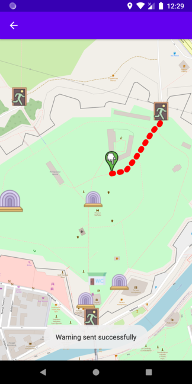

# Diplomski rad - Client

## Opis
Ovo je client prakticnog dela diplomskog rada. U pitanju je android applikacija
koja pomaze korisniku u ucestovanju na nekom dogadjaju kao sto je Nishville.

# Sign In Ekran i Sign Up Ekran

# Home ekrani

# Create Feed i Update Feed ekrani

# Feed Preview i Image Preview ekrani

# Feed na mapi kada se klikne na pin ikonici na Home ekranu, ili na info notifikaciju koja je stigla (plava ikonica na mapi)

# Mapa

# Izgled mape kada je nacrtana runa koja pokazuje put do najblizeg izlaza, do ovog ekrana se moze doci kada mi posaljem WARNING notifikaciju, ili kada kliknemo na WARNING notifikaciju koja je nama stigla

# Ukoliko kliknemo na neku ikonicu koja je bina (stage) prikazace se lista izvodjaca za tu binu. Ukoliko je izvodjac vec poceo, ili zavrsio, stavka u listi ce biti siva

# Settings ekran gde podesavamo da li zelimo da primamo info notifikacije, i ukoliko zelimo, unutar kog radijusa. Podesavamo takodje neke osnovne informacije korisnika

# Ekran za rezervaciju karata - ovde korisnik moze da rezervise do 10 karata. QR sluzi za naplacivanje karata na ulazu

